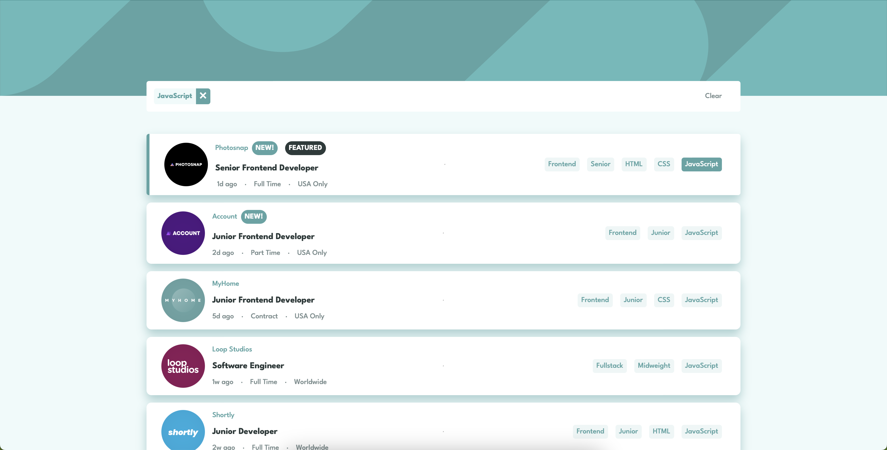
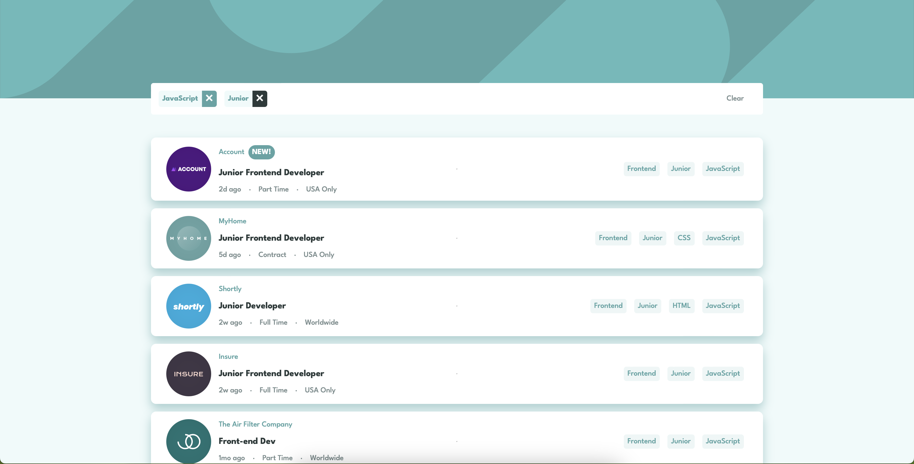

## About Me

- LinkedIn - [Felipe Stefani](https://www.linkedin.com/in/felipe-stefani-a35185116/)
- Instagram - [@felipestefani](https://www.instagram.com/felipestefani/)
- Frontend Mentor - [@felipestefani](https://www.frontendmentor.io/profile/felipestefani)

# Frontend Mentor - Job listings with filtering solution

This is a solution to the [Job listings with filtering challenge on Frontend Mentor](https://www.frontendmentor.io/challenges/job-listings-with-filtering-ivstIPCt). Frontend Mentor challenges help you improve your coding skills by building realistic projects. 

## Table of contents

- [Overview](#overview)
  - [The challenge](#the-challenge)
  - [Screenshot](#screenshot)
  - [Links](#links)
- [My process](#my-process)
  - [Built with](#built-with)
  - [What I learned](#what-i-learned)
- [Author](#author)
- [Acknowledgments](#acknowledgments)

**Note: Delete this note and update the table of contents based on what sections you keep.**

## Overview

### The challenge

Users should be able to:

- View the optimal layout for the site depending on their device's screen size
- See hover states for all interactive elements on the page
- Filter job listings based on the categories

### Screenshot




### Links

- Solution URL: [https://github.com/felipestefani/job-listings](https://github.com/felipestefani/job-listings)
- Live Site URL: [Add live site URL here](https://your-live-site-url.com)

## My process

### Built with

- Semantic HTML5 markup
- CSS custom properties
- Flexbox
- [Vue](https://vuejs.org/) - JS framework

### What I learned

In this project, the main goal was to filter the jobs, so the code block bellow is important:

```js
    const filter = job => {
        const fullList = [job.role, job.level, ...job.languages]
        const skills = filter.value.filter( item => fullList.includes(item))
        return skills.length == filter.value.length
    }
```

## Author

- LinkedIn - [Felipe Stefani](https://www.linkedin.com/in/felipe-stefani-a35185116/)
- Instagram - [@felipestefani](https://www.instagram.com/felipestefani/)
- Frontend Mentor - [@felipestefani](https://www.frontendmentor.io/profile/felipestefani)


